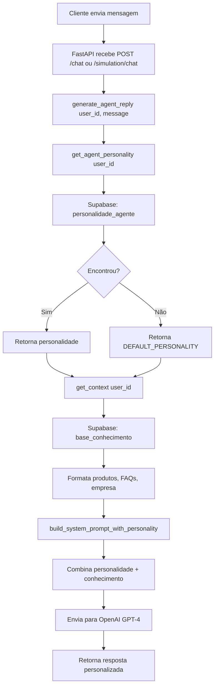

# Documentação: Integração de Personalidade do Agente

## Visão Geral

O backend FastAPI agora está completamente integrado com a tabela `personalidade_agente` do Supabase, permitindo que cada usuário configure o comportamento e estilo de comunicação do seu assistente virtual.

## Arquitetura

### Tabelas Utilizadas

#### 1. `personalidade_agente`
Armazena a configuração de personalidade do agente para cada usuário.

```sql
CREATE TABLE personalidade_agente (
  id UUID PRIMARY KEY DEFAULT gen_random_uuid(),
  user_id UUID NOT NULL REFERENCES auth.users(id) ON DELETE CASCADE UNIQUE,
  nome VARCHAR(255) NOT NULL DEFAULT 'Assistente Virtual',
  nivel_personalidade INTEGER NOT NULL DEFAULT 5 CHECK (nivel_personalidade >= 1 AND nivel_personalidade <= 10),
  tom_voz VARCHAR(50) NOT NULL DEFAULT 'amigavel' CHECK (tom_voz IN ('formal', 'amigavel', 'objetivo', 'descontraido')),
  forma_tratamento VARCHAR(50) NOT NULL DEFAULT 'voce' CHECK (forma_tratamento IN ('voce', 'senhor', 'informal')),
  apresentacao_inicial TEXT,
  created_at TIMESTAMP WITH TIME ZONE DEFAULT NOW(),
  updated_at TIMESTAMP WITH TIME ZONE DEFAULT NOW()
);
```

#### 2. `base_conhecimento`
Armazena o conhecimento do agente (produtos, serviços, FAQs, etc.)

**Categorias suportadas:**
- `produto`: Produtos com múltiplos planos de preço
- `servico`: Serviços oferecidos
- `empresa`: Informações sobre a empresa
- `faq`: Perguntas frequentes
- `personalizado`: Conteúdo customizado

## Módulos Criados

### 1. `src/services/personality_service.py`

Novo módulo responsável por buscar e formatar a personalidade do agente.

#### Funções principais:

##### `get_agent_personality(user_id: str) -> Dict[str, Any]`
Busca a configuração de personalidade do usuário no Supabase.

**Retorna:**
```python
{
    "nome": "RAG-E Assistant",
    "nivel_personalidade": 7,
    "tom_voz": "amigavel",
    "forma_tratamento": "voce",
    "apresentacao_inicial": "Oi! Como posso ajudar?"
}
```

**Fallback:** Se não encontrar personalidade, retorna valores padrão:
```python
DEFAULT_PERSONALITY = {
    "nome": "Assistente Virtual",
    "nivel_personalidade": 5,
    "tom_voz": "amigavel",
    "forma_tratamento": "voce",
    "apresentacao_inicial": "Olá! Como posso ajudar?"
}
```

##### `format_personality_context(personality: Dict) -> str`
Formata a personalidade em texto legível para o contexto da IA.

**Exemplo de saída:**
```
=== PERSONALIDADE DO AGENTE ===
Nome: RAG-E Assistant
Nível de Personalidade: 7 (Casual)
Tom de Voz: amigavel
Forma de Tratamento: voce
Mensagem Inicial: "Oi! Sou o RAG-E. Como posso ajudar? 😊"

Instruções de comportamento:
- Use tom conversacional, seja caloroso e acessível
- Trate o cliente por 'você'
```

##### `build_system_prompt_with_personality(kb_context: str, personality: Dict) -> str`
Combina personalidade + base de conhecimento em um prompt completo para a IA.

#### Mapeamentos de Personalidade

**Níveis de Personalidade (1-10):**
```python
NIVEIS_PERSONALIDADE = {
    1: "Extremamente formal",
    2: "Formal",
    3: "Levemente formal",
    4: "Equilibrado tendendo ao formal",
    5: "Equilibrado (profissional e amigável)",
    6: "Equilibrado tendendo ao casual",
    7: "Casual",
    8: "Animado e entusiasmado",
    9: "Muito entusiasmado",
    10: "Técnico e especialista"
}
```

**Tom de Voz:**
```python
TOM_VOZ_INSTRUCOES = {
    "formal": "Use linguagem formal, evite gírias e contrações",
    "amigavel": "Use tom conversacional, seja caloroso e acessível",
    "objetivo": "Seja direto e conciso, foque nos fatos",
    "descontraido": "Use linguagem casual, gírias são bem-vindas"
}
```

**Forma de Tratamento:**
```python
FORMA_TRATAMENTO_INSTRUCOES = {
    "voce": "Trate o cliente por 'você'",
    "senhor": "Trate o cliente por 'senhor' ou 'senhora'",
    "informal": "Use tratamento informal como 'tu' se apropriado"
}
```

### 2. Atualização em `app.py`

A função `generate_agent_reply()` foi atualizada para usar o novo serviço:

**Antes:**
```python
def generate_agent_reply(user_id: str, message: str, x_request_id: Optional[str] = None):
    context = get_context(owner_id=user_id)
    user_config = get_user_config(user_id)  # Tabela antiga: configuracao_empresa
    system_prompt = build_system_prompt(context, user_config)
    # ...
```

**Depois:**
```python
def generate_agent_reply(user_id: str, message: str, x_request_id: Optional[str] = None):
    context = get_context(owner_id=user_id)
    personality = get_agent_personality(user_id)  # Nova tabela: personalidade_agente
    system_prompt = build_system_prompt_with_personality(context, personality)
    # ...
```

### 3. Melhorias em `src/services/supabase_service.py`

A função `format_empresa()` foi corrigida para suportar os novos campos:

```python
def format_empresa(dados: Dict[str, Any]) -> str:
    """Format company/business info."""
    lines = []
    
    # Support both old and new field names
    titulo = dados.get("titulo") or dados.get("topico")
    conteudo = dados.get("descricao") or dados.get("conteudo")
    
    if titulo:
        lines.append(f"INFORMAÇÃO: {titulo}")
    
    if conteudo:
        lines.append(conteudo)
    
    if dados.get("informacoes_adicionais"):
        lines.append(dados["informacoes_adicionais"])
    
    return "\n".join(lines)
```

## Fluxo Completo



## Exemplo de Contexto Completo

### Input:
```python
user_id = "6bf0dab0-e895-4730-b5fa-cd8acff6de0c"
message = "Quais planos vocês oferecem?"
```

### Contexto Gerado (System Prompt):

```
=== PERSONALIDADE DO AGENTE ===
Nome: RAG-E Assistant
Nível de Personalidade: 7 (Casual)
Tom de Voz: amigavel
Forma de Tratamento: voce
Mensagem Inicial: "Oi! Sou o RAG-E. Como posso ajudar? 😊"

Instruções de comportamento:
- Use tom conversacional, seja caloroso e acessível
- Trate o cliente por 'você'

=== BASE DE CONHECIMENTO ===

PRODUTO: RAG-E
Categoria: Software
Tipo: Assinatura (Múltiplos Planos)
Descrição: Plataforma de atendimento inteligente com IA

Planos disponíveis:

Plano Essencial:
  Preço mensal: R$ 260
  Preço anual: R$ 2600 (2 meses Grátis)
  Benefícios:
    • Atendimento com IA
    • Base de conhecimento personalizada
    • Integração WhatsApp
  Limite de usuários: 5 usuários
  Limite de conversas: 1000 conversas/mês
  Ideal para: Pequenos negócios

Plano Profissional:
  Preço mensal: R$ 520
  Preço anual: R$ 5200 (2 meses Grátis)
  Benefícios:
    • Todos os recursos do Essencial
    • Múltiplos canais
    • Relatórios avançados
  Limite de usuários: 15 usuários
  Limite de conversas: 5000 conversas/mês
  Ideal para: Médias empresas

FAQ: Qual o horário de atendimento?
Resposta: Segunda a sexta, das 9h às 18h.

INFORMAÇÃO: Nossa Missão
Revolucionar o atendimento ao cliente através de IA

=== INSTRUÇÕES ===
Você é o assistente virtual configurado acima. Use APENAS as informações fornecidas na base de conhecimento para responder.
Se não souber a resposta, seja honesto e ofereça ajuda para entrar em contato com um humano.
Mantenha a personalidade e tom de voz especificados.
Responda sempre em português brasileiro.
```

## Como Usar

### 1. Inserir Personalidade do Agente

```python
from src.services.supabase_service import _client

personality_data = {
    "user_id": "seu-user-id-aqui",
    "nome": "Meu Assistente",
    "nivel_personalidade": 5,
    "tom_voz": "amigavel",
    "forma_tratamento": "voce",
    "apresentacao_inicial": "Olá! Como posso ajudar você hoje?"
}

_client.table("personalidade_agente").insert(personality_data).execute()
```

### 2. Inserir Base de Conhecimento

```python
# Produto com múltiplos planos
produto = {
    "user_id": "seu-user-id-aqui",
    "categoria": "produto",
    "dados": {
        "nome": "Meu Produto",
        "tipo_produto": "assinatura_multiplos_planos",
        "descricao": "Descrição do produto",
        "planos": [
            {
                "nome": "Básico",
                "preco_mensal": "100",
                "preco_anual": "1000",
                "beneficios": ["Benefício 1", "Benefício 2"]
            }
        ]
    }
}

_client.table("base_conhecimento").insert(produto).execute()
```

### 3. Testar via API

```bash
curl -X POST http://localhost:8000/simulation/chat \
  -H "Content-Type: application/json" \
  -d '{
    "user_id": "seu-user-id-aqui",
    "message": "Quais planos você oferece?"
  }'
```

## Scripts de Teste

### `test_personality_integration.py`
Script completo que:
1. Limpa dados antigos
2. Insere personalidade customizada
3. Insere base de conhecimento (produto + FAQ + empresa)
4. Testa todas as funções
5. Exibe o prompt completo gerado

**Executar:**
```bash
python test_personality_integration.py
```

### `test_empresa_format.py`
Teste específico para formatação de informações da empresa.

**Executar:**
```bash
python test_empresa_format.py
```

## Vantagens da Nova Estrutura

### ✅ Separação de Responsabilidades
- `personality_service.py`: Cuida da personalidade do agente
- `supabase_service.py`: Cuida da base de conhecimento
- `app.py`: Orquestra tudo

### ✅ Fallback Robusto
- Se personalidade não existir, usa defaults
- Se base de conhecimento estiver vazia, informa ao usuário
- Nunca quebra o chat

### ✅ Flexibilidade
- Cada usuário tem sua própria personalidade
- Configuração granular (10 níveis de personalidade)
- 4 tons de voz diferentes
- 3 formas de tratamento

### ✅ Escalabilidade
- Suporta múltiplos tipos de produtos
- Base de conhecimento em JSONB (flexível)
- Fácil adicionar novas categorias

## Próximos Passos

1. **Frontend React**: Criar interface para configurar personalidade
2. **Cache**: Adicionar cache de personalidade para reduzir queries
3. **Analytics**: Rastrear quais personalidades geram mais engajamento
4. **A/B Testing**: Testar diferentes configurações de personalidade
5. **Validação**: Adicionar validação de campos no frontend

## Troubleshooting

### Problema: Personalidade não encontrada
**Solução:** Verifique se o `user_id` está correto e se há registro na tabela `personalidade_agente`. O sistema usará defaults automaticamente.

### Problema: Base de conhecimento vazia
**Solução:** Insira pelo menos um item na tabela `base_conhecimento` com a categoria desejada.

### Problema: Formatação estranha no contexto
**Solução:** Verifique se os campos JSONB em `dados` seguem a estrutura esperada para cada categoria.

### Problema: Encoding errors (emojis)
**Solução:** No Windows, ao executar scripts com emojis, use UTF-8:
```bash
python -X utf8 test_personality_integration.py
```

## Referências

- [Documentação Supabase Python](https://supabase.com/docs/reference/python)
- [FastAPI Best Practices](https://fastapi.tiangolo.com/tutorial/)
- [OpenAI API Guide](https://platform.openai.com/docs/guides/text-generation)
